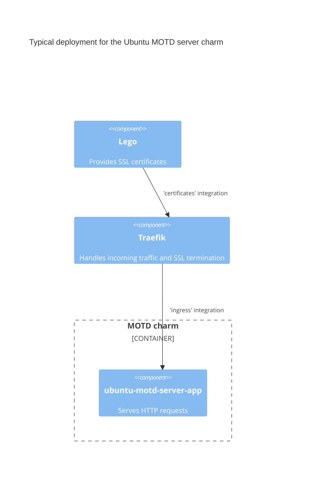

# Architecture overview

A typical deployment of the `ubuntu-motd-server` charm will involve and `ingress` provider and a `certificate` provider to expose the service over HTTPS.

You can see an example in the following diagram:

