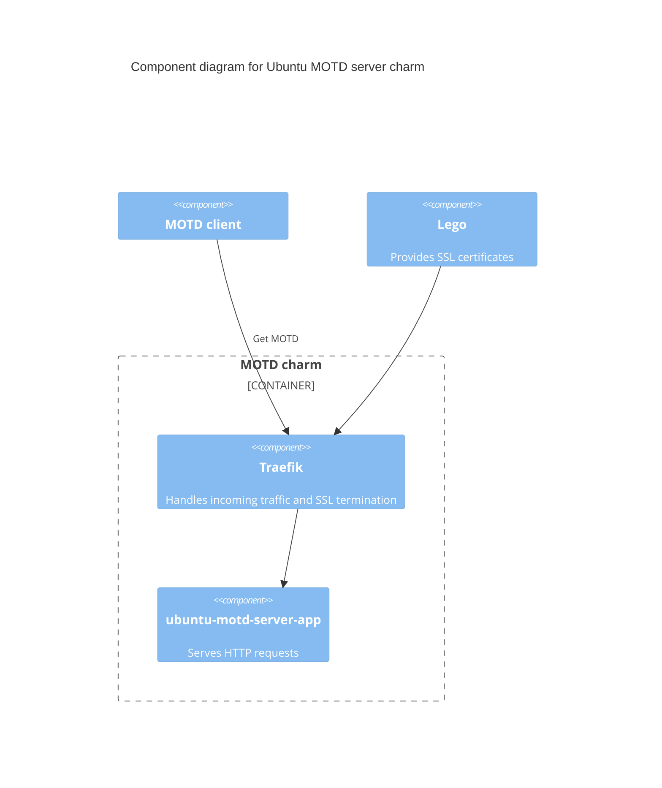

# Charm architecture

At its core, the `ubuntu-motd-server` charm is deploying a [Flask](https://flask.palletsprojects.com/) application that serves a Message Of The Day (MOTD) for Ubuntu clients.

It has been generated with the help of the [paas-charm](https://github.com/canonical/paas-charm/) project for Flask applications.

## High-level overview of `ubuntu-motd-server` deployment

The following diagram shows a typical deployment of the `ubuntu-motd-server` charm.

## OCI images

We use [Rockcraft](https://canonical-rockcraft.readthedocs-hosted.com/en/latest/) to build OCI Images for `ubuntu-motd-server`.
The images are defined in [rockcraft.yaml](https://github.com/canonical/ubuntu-motd-server-operator/blob/main/motd-server-app/rockcraft.yaml) file.
They are published to [Charmhub](https://charmhub.io/), the official repository of charms.

> See more: [How to publish your charm on Charmhub](https://canonical-charmcraft.readthedocs-hosted.com/en/stable/howto/manage-charms/#publish-a-charm-on-charmhub)
